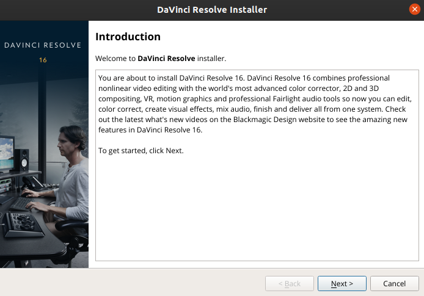
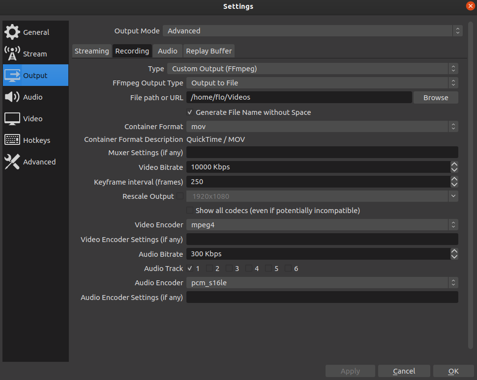
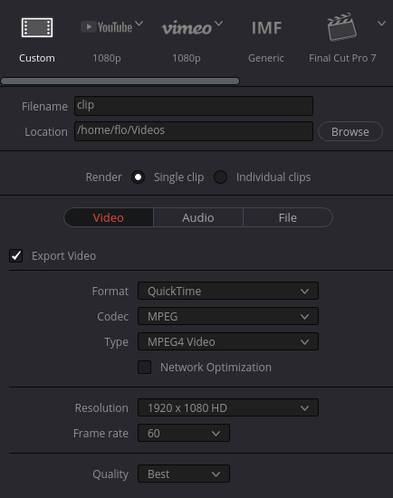
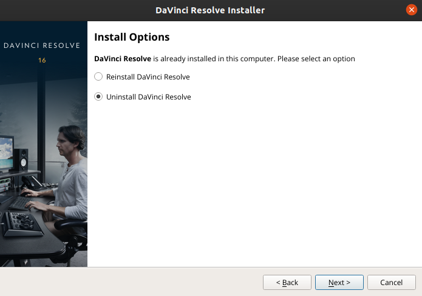

# DaVinci Resolve on Linux (Debian)

<!-- TODO Insert thumbnail as image -->
<!-- TODO Link YouTube video -->

> Davinci Resolve is one of the most powerful **free** video editing software out there. But installing and using the software on Linux can be quite painful at first. This guide will help you to get started with Davinci Resolve on Linux (Ubuntu) in no time.

## Contents

- [Prerequisites](https://github.com/flolude/davinci-resolve-linux#prerequisites)
- [Installation](https://github.com/flolude/davinci-resolve-linux#installation)
- [Media Import](https://github.com/flolude/davinci-resolve-linux#media-import)
- [Media Export](https://github.com/flolude/davinci-resolve-linux#media-export)
- [Uninstall Resolve](https://github.com/flolude/davinci-resolve-linux#uninstall-resolve)
- [Handle Common Issues](https://github.com/flolude/davinci-resolve-linux#handle-common-issues)
- [Install NVIDIA driver](https://github.com/flolude/davinci-resolve-linux#install-nvidia-driver)

## Prerequisites

- Debian-bases Linux distribution
- Relatively modern hardware
- NVIDIA graphics card
- [NVIDIA driver](https://github.com/flolude/davinci-resolve-linux#install-nvidia-driver)

## Installation

**Method 1** (recommended)

1. Head to https://www.blackmagicdesign.com/products/davinciresolve
2. Click on "Download"
3. Select the free Linux version
4. Unzip `DaVinci_Resolve_XX.Y.Z_Linux.zip` archive
5. Double click `DaVinci_Resolve_XX.Y.Z_Linux.run` and follow installation guide

   - or run `./DaVinci_Resolve_XX.Y.Z_Linux.run`

   

6. Start Resolve by searching for it in your applications

   - or run `/opt/resolve/bin/resolve`

**Method 2**

1. Head to https://www.blackmagicdesign.com/products/davinciresolve
2. Click on "Download"
3. Select the free Linux version
4. Unzip `DaVinci_Resolve_XX.Y.Z_Linux.zip` archive
5. Head to https://www.danieltufvesson.com/makeresolvedeb
6. Download script with same version as your downloaded Resolve
7. Unzip `makeresolvedeb_XX.Y.Z-X.sh.tar.gz`

- Your folder should now include the following files:
  ```
  DaVinci_Resolve_Studio_XX.Y.Z_Linux.run
  Linux_Installation_Instructions.pdf
  makeresolvedeb_XX.Y.Z-X.sh
  ```

8. Run the `makeresolvedeb` script

- For free version of DaVinci Resolve run:

  ```
  ./makeresolvedeb_XX.Y.Z-X.sh lite
  ```

- For Studio version of DaVinci Resolve run:

  ```
  ./makeresolvedeb_XX.Y.Z-X.sh studio
  ```

9. Install the Resolve via the created `.deb` file

- Double click and click "Install"
- Or run in terminal:

  ```
  sudo dpkg -i davinci-resolve_XX.Y.Z-X_amd64.deb
  ```

10. If you get an error saying "Sorry. Need 'xyz' to continue", just install it

- For example if the error is: "Sorry. Need 'xorriso' to continue", you should run:

  ```
  sudo apt-get install xorriso
  ```

## Media Import

Unfortunately DaVinci Resolve free version doesn't support `.mp4` import on Linux. But we can work around this issue:

**Convert your footage to a supported format**

There is a really powerful tool called [FFmpeg](https://www.ffmpeg.org/) for converting video file formats. You can install it by running `sudo apt install ffmpeg`.

Then you can convert almost any video format to something, that can be imported into DaVinci Resolve by running:

```
ffmpeg -i <input> -c:v prores_ks -profile:v 3 -qscale:v 9 <output.mov>
```

| Flag              | Explanation                                                                         |
| ----------------- | :---------------------------------------------------------------------------------- |
| `-i <input>`      | input video file (e.g. `-i my-movie.mp4`)                                           |
| `-c:v prores_ks`  | video codec to be ProRes Kostya                                                     |
| `-profile:v 3`    | profile (value ranges from 0 to 3, where a higher number results in better quality) |
| `-qscale:v 9`     | quality scale (value can be 5, 9 or 13, where 5 is best and 13 worst quality)       |
| `-i <output.mov>` | output video file (e.g. `-i my-movie-converted.mov`)                                |

**Record your footage as a supported format with [Open Broadcaster Software](https://obsproject.com/)**

1. Go to "Settings" 🠪 "Output" 🠪 "Recording"
2. Change "Type" to "Custom Output (FFmpeg)"
3. Set "Container Format" to "mov"
4. Set "Video Encoder" to "mpeg4"
5. Set "Audio Encoder" to "pcm_s16le"



The resulting `.mov` can now be imported into DaVinci Resolve without any issues.

## Media Export

When exporting your edited video, I'd recommend:

1. Head to your "Render Settings"
2. Under Video, choose "QuickTime" as "Format"
3. Under Video, choose "MPEG" as "Format"
4. Under Audio, enable "Export Audio" if you want sound



With the above settings, you don't need to compress or convert the final file again.

## Uninstall Resolve

**Method 1** (recommended)

Run the same script, you used for installing Resolve (`DaVinci_Resolve_XX.Y.Z_Linux.run`) and choose "Uninstall DaVinci Resolve" in the second step.



**Method 2**

```
sudo rm -f -r /opt/resolve
sudo rm -f -r ~/Documents/BlackmagicDesign
```

## Handle Common Issues

If the installation doesn't work, you probably need to research any errors from the log output.

If DaVinci Resolve doesn't start after installing you might try the following:

- Boot resolve by running `/opt/resolve/bin/resolve` and check the log output for errors
- Open `~/.local/share/DaVinciResolve/logs/` and search for errors in the log files
- Make sure you have CUDA and OpenCL libraries installed
- If you're getting an error saying, that you need `ibOpenCL.so` then just run `sudo apt install ocl-icd-opencl-dev`

If nothing fixed your issue, you can always get fast help on the [Blackmagic Forum](https://forum.blackmagicdesign.com/)

## Install NVIDIA driver

Determine recommended driver by running

```
ubuntu-drivers devices | grep recommended
```

The output will look like this:

```
driver : nvidia-driver-440 - third-party free recommended
```

Install recommended driver by running:

```
sudo apt install nvidia-driver-440
```

You can also install it in the user interface by opening "Additional Drivers":


Then reboot you computer.

---

> Alternatively you can use this [excellent guide](https://askubuntu.com/questions/61396/how-do-i-install-the-nvidia-drivers/61433#61433)
